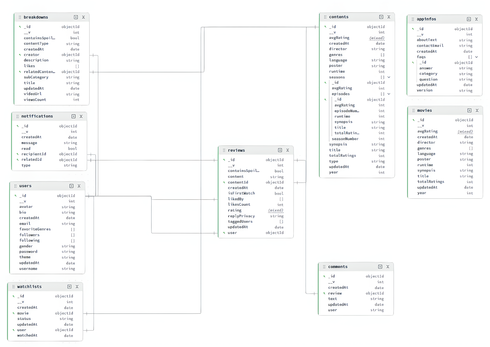

The Cinema Warehouse: Your Perfect Movie & Series Enthusiasts App
----------------------------------------------------

**Inspired by: Letterboxd**

--------------------------------------------------------------
<a href="https://ibb.co.com/gL2jBSwk"></a>

**This website is created by:**  
Mochammad Rafly Fatih Rabbani - 2406369021  
Ryan Gazendra Irawan - 2406368952  
Raul Fadila Bagus Sumaryada - 2406450466    

**2026 Copyright. AkuWnC Association®***  
-------------------------------------------------------------

*Disclaimer: group name is created for aesthetical purpose only. We are no official association group.

-----------------------------------------------
**Overview**  
TheCinemaWarehouse is a global social network for grass-roots film discussion and discovery inspired by Letterboxd. We use it as:  
• a diary to record and share opinions about films  
• keeping track of films seen in the past  
• Rate, review and tag films as we add them  
• Find and follow friends to see what they’re enjoying  
• Keep a watchlist of films we’d like  
• Create lists/collections on any given topic  
• Breakdowns & Video Essays from cinephile creators  

-----------------------------------------------------------

Implementing Database Systems using the Combination of MongoDB & Neo4j


<a href="https://ibb.co.com/60PYjtPH"></a>

<a href="https://ibb.co.com/CpXvTqSJ"></a>

**Design Decisions**    
The website application implements Neo4j because the core of the application is build with relationships between users and movies, not just storing data. Features like ratings, comments, and especially movie recommendations depend on how users are connected through shared interests. Neo4j, as a graph database, is optimized for this type of structure, allowing efficient queries such as finding similar users or recommending movies based on connected patterns. This makes it much more suitable than traditional databases for handling multi-step relationships and recommendation logic.

MongoDB is used alongside Neo4j to handle flexible and content-heavy data, such as movie details, user profiles, and longer reviews. It allows fast retrieval of structured and semi-structured data without complex relationships. Our team also implements MongoDB Atlas' built-in data modelling feature to visualize our MongoDB schema diagram. By combining both, the system benefits from Neo4j’s strength in relationship analysis and MongoDB’s efficiency in data storage, resulting in a more scalable and well-structured application.

--------------------------------------------------------------
**Project Structure**    

```text
AkuWnC_Database_FINPRO/  
├── backend/  
│   ├── src/  
│   │   ├── config/  
│   │   │   ├── mongo.js  
│   │   │   └── neo4j.js  
│   │   ├── controllers/  
│   │   │   ├── appIngfoController.js  
│   │   │   ├── authController.js  
│   │   │   ├── breakdownController.js  
│   │   │   ├── commentController.js  
│   │   │   ├── graphController.js  
│   │   │   ├── movienSeriesController.js  
│   │   │   ├── notificationController.js  
│   │   │   ├── reviewController.js  
│   │   │   ├── userController.js  
│   │   │   └── watchlistController.js  
│   │   ├── middleware/  
│   │   │   └── authMiddleware.js  
│   │   ├── models/  
│   │   │   ├── models.mongodb/  
│   │   │   │   ├── appingfo.model.js  
│   │   │   │   ├── breakdown.model.js  
│   │   │   │   ├── comment.model.js  
│   │   │   │   ├── movienseries.model.js  
│   │   │   │   ├── notification.model.js  
│   │   │   │   ├── review.model.js  
│   │   │   │   ├── user.model.js  
│   │   │   │   └── watchlist.model.js  
│   │   │   └── models.neo4j/  
│   │   │       ├── comment.model.js  
│   │   │       └── graph.model.js  
│   │   ├── routes/  
│   │   │   ├── appIngfoRoute.js  
│   │   │   ├── authRoute.js  
│   │   │   ├── breakdownRoute.js  
│   │   │   ├── commentRoute.js  
│   │   │   ├── graphRoute.js  
│   │   │   ├── movienseriesRoute.js  
│   │   │   ├── notificationRoute.js  
│   │   │   ├── reviewPageRoute.js  
│   │   │   ├── userRoute.js  
│   │   │   └── watchlistRoute.js  
│   │   ├── seed/  
│   │   │   ├── mongo.seed.js  
│   │   │   └── neo4j.seed.js  
│   │   ├── utils/  
│   │   │   ├── dateFormatter.js  
│   │   │   ├── passwordUtils.js  
│   │   │   ├── responseHandler.js  
│   │   │   ├── slugify.js  
│   │   │   └── tokenService.js  
│   │   └── index.js  
│   ├── Dockerfile  
│   ├── package-lock.json  
│   └── package.json  
├── benchmarks/  
│   ├── plots/  
│   ├── results/  
│   ├── scripts/  
│   ├── README.md              # benchmark README file  
│   ├── package-lock.json  
│   └── package.json  
├── docs/  
│   ├── Neo4j/   
│   ├── AkuWnC_DataModel(MongoDB).md  
│   ├── AkuWnC_DataModel(Neo4j).md  
│   └── MongoDB Diagram.md  
├── frontend/  
│   ├── app/  
│   │   ├── components/  
│   │   │   ├── AboutPage.tsx  
│   │   │   ├── BreakdownsPage.tsx  
│   │   │   ├── EditProfileModal.tsx  
│   │   │   ├── FilmsPage.tsx  
│   │   │   ├── FriendsBar.tsx  
│   │   │   ├── GenreStats.tsx  
│   │   │   ├── Header.tsx  
│   │   │   ├── LoginModal.tsx  
│   │   │   ├── MovieDetailModal.tsx  
│   │   │   ├── PopularReviews.tsx  
│   │   │   ├── ProfileMovieModal.tsx  
│   │   │   ├── ProfilePage.tsx  
│   │   │   ├── RecommendedMovies.tsx  
│   │   │   ├── ReviewComments.tsx  
│   │   │   ├── ReviewsPage.tsx  
│   │   │   ├── Sidebar.tsx  
│   │   │   ├── StandoutMovies.tsx  
│   │   │   └── WatchlistPage.tsx  
│   │   ├── config/  
│   │   │   └── api.ts  
│   │   ├── favicon.ico  
│   │   ├── globals.css  
│   │   ├── layout.tsx  
│   │   └── page.tsx  
│   ├── public/  
│   │   ├── file.svg  
│   │   ├── globe.svg  
│   │   ├── icon.png  
│   │   ├── next.svg  
│   │   ├── prototype.html  
│   │   ├── styles.css  
│   │   ├── vercel.svg  
│   │   └── window.svg  
│   ├── resource/  
│   │   ├── TheCinemaWarehouse_Logo.png  
|   |   └── TheCinemaWarehouse_Logo_Minimized.png  
│   ├── .gitignore  
│   ├── AGENTS.md  
│   ├── CLAUDE.md  
│   ├── Dockerfile  
│   ├── README.md              # frontend README file  
│   ├── eslint.config.mjs  
│   ├── next.config.ts  
│   ├── package-lock.json  
│   ├── package.json  
│   ├── postcss.config.mjs  
│   ├── tailwind.config.js  
│   └── tsconfig.json  
├── .gitignore  
├── README.md  
├── docker-compose.yml  
└── package-lock.json  
```  

-----------------------------------------------------------
**Architecture Diagram**
------------------------
**MongoDB Diagram**  
Our team implements MongoDB Atlas' built-in data modelling feature to visualize our MongoDB diagram.   
  
  
**Neo4j Relationahip Diagram**
_Follows_  
<a href="https://imgbb.com/"></a>

_Rated Users to Movies_  
<a href="https://imgbb.com/"></a>

_Rated Users to Series_  
<a href="https://imgbb.com/"></a>

_Tagged Movies to Genre_  
<a href="https://imgbb.com/"></a>

_Tagged Series to Genres_  
<a href="https://imgbb.com/"></a>

_User to Movie or Series Details_  
<a href="https://imgbb.com/"></a>


---------------------------------------------------------------


**Tech Platforms**

| Platform | Implementation | 
| -------- | -------- | 
| Neo4j     | Backend (Graphs)    | 
| Tailwind CSS + TypeScript | Frontend |
| Docker     | Database Deployment |
| MongoDB  | Backend (Basic Features) |
| Next.js | API & Frontend | 
| Cloudinary | Saving Avatars |


------------------------------------------------------------- 
**Features**  
- Explore Popular Movies & Series  
- Review, Like, and Post Movie/Series Ratings  
- Create Personalized Watchlist  
- Connect with other Movie Reviewers  
- **_Original Features_**: Movie/Series Breakdown Page  

------------------------------------------------------------
**Page Preview**  

Dashboard  
<a href="https://ibb.co.com/354S9spX"></a>  

Profile Page & Notification Display  
<a href="https://ibb.co.com/wNc6GsrL"></a>  

Breakdown Page (**_ORIGINAL_**)    
<a href="https://ibb.co.com/Sw1PkBrV"></a>  

Review Page  
<a href="https://ibb.co.com/b5S45hKW"></a>  

About Page  
<a href="https://ibb.co.com/BKjN1N2k"></a>  

--------------------------------------------------------------------------------------------------------
**How to Run**
------
**1. Install Dependencies on Both Frontend & Backend Files**  
_Frontend_  
``` bash
 cd frontend
npm install
```

_Backend_  
``` bash
cd backend
npm install
```

**2. Add .env file on both Frontwnd & Backend**   
_frontend/.env_
``` bash
NEXT_PUBLIC_API_URL=http://localhost:3001
```

_backend/.env_
``` bash
MONGO_URI=mongodb+srv://...
NEO4J_URI=neo4j+s://...
NEO4J_USER=...
NEO4J_PASSWORD=...
CLOUDINARY_CLOUD_NAME=...
CLOUDINARY_API_KEY=...
CLOUDINARY_API_SECRET=...
```
**3. Seed the Databases**  
```bash
cd backend
```
_Seed Neo4j_
```bash
run seed-neo4j
```
_Seed MongoDB_
```bash
run seed-mongo
```
**4. Run on Development**  
_Frontend_
```bash
cd frontend
npm run dev
```
_Backend_
```bash
cd backend
npm run dev
```

**TO RUN IN DOCKER**
1. User are obliged to have the Docker App installed and should be opened.
2. Run docker on root file with

```bash
docker-compose up --build
```

3. If done, _Ctrl + C_ to stop the container.
4. Do:
```bash
docker-compose down
```
   This is to remove the containers completely from local disk and release the used ports (optional, but recommended for clean up).


--------------------------------------------------------------------------------------------------------
**References**  
All Movie and Series information are sourced from: https://www.imdb.com/  
All Movies and Series image posters are sourced from: https://www.themoviedb.org/  


